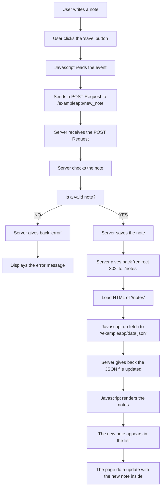
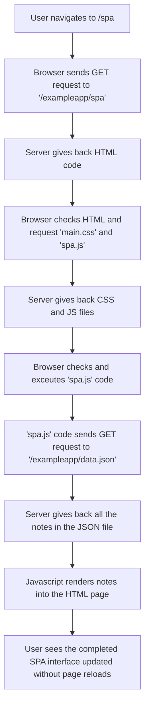
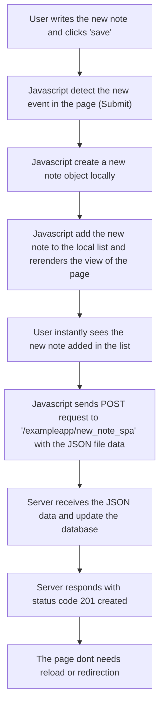

# Excersice : Mermaid Flow (New Note)

```mermaid
flowchart TD
    A["User writes a note"] --> B["User clicks the 'save' button"]
    B --> C["Javascript reads the event"]
    C --> D["Sends a POST Request to '/exampleapp/new_note'"]
    D --> E["Server receives the POST Request"]
    E --> F["Server checks the note"]
    F --> G["Is a valid note?"]

    G -->|NO| I["Server gives back 'error'"]
    I --> J["Displays the error message"]

    G -->|YES| K["Server saves the note"]
    K --> L["Server gives back 'redirect 302' to '/notes'"]
    L --> M["Load HTML of '/notes'"]
    M --> N["Javascript do fetch to '/exampleapp/data.json'"]
    N --> P["Server gives back the JSON file updated"]
    P --> Q["Javascript renders the notes"]
    Q --> R["The new note appears in the list"]
    R --> S["The page do a update with the new note inside"]
```

# Excersice : Mermaid Flow (Enter SPA)

```mermaid
flowchart TD
    A["User navigates to /spa"] --> B["Browser sends GET request to '/exampleapp/spa'"]
    B --> C["Server gives back HTML code"]
    C --> D["Browser checks HTML and request 'main.css' and 'spa.js'"]
    D --> E["Server gives back CSS and JS files"]
    E --> F["Browser checks and exceutes 'spa.js' code"]
    F --> G["'spa.js' code sends GET request to '/exampleapp/data.json'"]
    G --> H["Server gives back all the notes in the JSON file"]
    H --> I["Javascript renders notes into the HTML page"]
    I --> J["User sees the completed SPA interface updated without page reloads"]
```

# Excersice : Mermaid Flow (Create note in SPA)

```mermaid
flowchart TD
    A["User writes the new note and clicks 'save'"] --> B["Javascript detect the new event in the page (Submit)"]
    B --> C["Javascript create a new note object locally"]
    C --> D["Javascript add the new note to the local list and rerenders the view of the page"]
    D --> E["User instantly sees the new note added in the list"]
    E --> F["Javascript sends POST request to '/exampleapp/new_note_spa' with the JSON file data"]
    F --> G["Server receives the JSON data and update the database"]
    G --> H["Server responds with status code 201 created"]
    H --> I["The page dont needs reload or redirection"]
```
    
